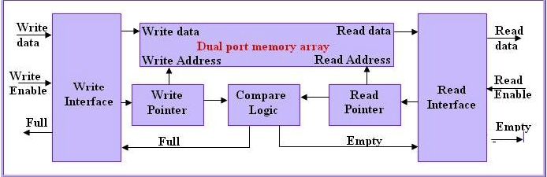

# FIFO Memory
 A FIFO or Queue is an array of memory to transfer transfer data between two circuits with different clocks. FIFO uses a dual port memory and there will be two pointers to point read and write addresses.[More information](https://www.globalspec.com/learnmore/semiconductors/memory_chips/fifo_memory_chips).
 
# Behavior 

#### Status signals
1. Full: high when FIFO is full.
2. Empty: high when FIFO is empty.
#### Counter 
Counter will be incremented if:
* Write takes place and buffer is not full.

Counter will be decremented if:

* Read takes place and buffer is not empty. 

🚫🚫🚫 If both read and write takes place, counter will remain the same.

Dependencies
============
## macOS
This project needs [Icarus-Verilog](http://iverilog.icarus.com) and a VCD viewer.

## Building on macOS
1. Icarus-Verilog can be installed via Homebrew :
   <code>$ brew install icarus-verilog</code>
2. Download [Scansion](http://www.logicpoet.com/scansion/) from here.  
3. Clone the repository.
4. Change the directory to src.
5. <code>$ make simulate</code> will: 
* compile design+TB
* simulate the verilog design

6. <code>$ make display</code> will: 
*  display waveforms.

------
### Block diagram of FIFO

